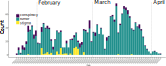
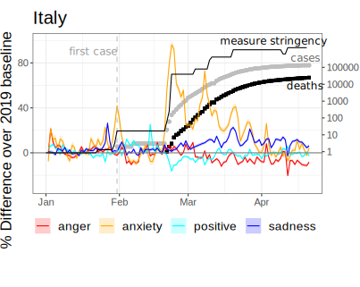
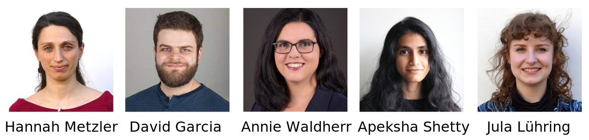

```{r xaringan-themer, include=FALSE, warning=FALSE}
# #This block contains the theme configuration for the CSS lab slides style
library(xaringanthemer) #
library(showtext)
style_mono_accent(
  base_color = "#1f5c99",
  text_font_size = "1.5rem",
  header_font_google = google_font("Raleway"),#("Yanone Kaffeesatz"),
  text_font_google   = google_font("Arial", "300", "300i"),
  code_font_google   = google_font("Fira Mono")
)
```

```{r setup, include=FALSE}
options(htmltools.dir.version = FALSE)
```


layout: true
---
class: inverse, center, middle, title-slide
background-image: url(figures/brain.png)
background-size: contain

# Emotional Misinformation Spreading
## Hannah Metzler
### Complexity Science Hub & Medical University of Vienna
### Intelligent Machines, Emotions and Our Planet <br> Stockholm - 14.01.2022

Slides: hannahmetzler.eu/emomis_stockholm


---
layout: true
<div class="my-footer"><span>
<a href="https://doi.org/10.1126/science.aao2998">Lazer et al. (2018). The science of fake news. </a></span></div>

---


# What is misinformation?
### False or misleading information

.pull-left[
<br><br>
```{r, echo=FALSE, out.width=500, fig.align='center'}

```
]
.pull-right[
* Independent of intent 
    * Intentional: Disinformation <br>

* Fake News <br>

* Biased information <br>

* Conspiracies & myths
]


???
If time: better picture for fake news - headlines?

---
layout: true
<div class="my-footer"><span>
<a href="https://www.nature.com/articles/s41598-020-73510-5#Fig3"> Cinelli et al. (2020);</a> 
<a href="https://www.ajtmh.org/view/journals/tpmd/103/4/article-p1621.xml">Islam et al. (2020) </a> 
<a href="https://reutersinstitute.politics.ox.ac.uk/types-sources-and-claims-covid-19-misinformation">Brennen et al. (2020); </a>
</span></div>

---

## COVID-19 & misinformation spreading

```{r, echo=FALSE, out.width=950, fig.align='center'}

```
.pull-left[.center-left[
```{r, echo=FALSE, out.width=700, fig.align='center'}
knitr::include_graphics("figures/Brennen2020_COVID_factcheck_increase.svg")
```
]]
.pull-right[.center-right[
```{r, echo=FALSE, out.width=700, fig.align='center'}

```


]]


???
if time: better month labels
knitr::include_graphics("figures/Akbar_misinfo_india.png")
<a href="http://joyojeet.people.si.umich.edu/an-archive-of-covid-19-related-fake-news-in-india/">Akbar et al. (2020) </a>

---
layout: true
<div class="my-footer"><span>
<a href="https://psyarxiv.com/qejxv/"> Metzler et al.  (2021) Collective emotions during the COVID-19 outbreak.</a> 
</span></div>
---


<!-- # COVID-19 & emotions on Twitter -->


<!-- ```{r, echo=FALSE, out.width=370} -->
<!-- knitr::include_graphics("figures/covid_emotions_legend.svg") -->
<!-- ``` -->
<!-- ```{r, echo=FALSE, out.width=700} -->
<!-- knitr::include_graphics("figures/EmotionTimelines_Italy_with_stringency_nolegend.svg") -->
<!-- ``` -->

<!-- ??? -->
<!-- - mention duration -->
<!-- - coordinated at the beginning, more intense in specific groups today -->

<!-- --- -->


## COVID-10 & emotional expressions on Twitter

.pull-left[
```{r, echo=FALSE, out.width=700, fig.align='center'}
knitr::include_graphics("figures/countrymap.svg")
```

* % tweets expressing an emotion
* Emotion dictionaries
* 18 countries - 6 languages
* 8.3 billion tweets
* 5 weeks after day with >30 cases
]

--

.pull-right[
```{r, echo=FALSE, out.width=700, fig.align='center'}

```
]

---
layout: true
<div class="my-footer"><span>
<a href="https://doi.org/10.1177/1750698017701615"> van Prooijen & Douglas (2017); </a> 
<a href="https://doi.org/10.1177/1948550620934692"> Imhoff & Lamberty (2020); </a> 

</span></div>
---


## Misinformation spreading: Why emotions?

* Increase of misinformation in crisis situations

    * Powerlessness and loss of control 
    * Sense making to reduce uncertainty
    
<br>
```{r, echo=FALSE, out.width=300}
knitr::include_graphics("https://www.statnews.com/wp-content/uploads/2020/03/AP_20081549688183.jpg")
```
```{r, echo=FALSE, out.width=355}
knitr::include_graphics("https://media0.faz.net/ppmedia/aktuell/feuilleton/1083995003/1.7264674/mmobject-still_full/nachdem-eine-krankenschwester.jpg")
```
```{r, echo=FALSE, out.width=265}

```


???
* Illusion of control and understanding

---
layout: true
<div class="my-footer"><span>
<a href="https://journals.sagepub.com/doi/10.1177/1754073908097189"> Rimé (2009); </a> 
<a href="https://journals.sagepub.com/doi/pdf/10.1177/0963721417718261">  Douglas et al. (2017); </a> 
<a href="https://www.pexels.com/photo/annoyed-black-woman-having-video-chat-on-smartphone-at-home-5699823/"> Photo by Alex Green </a> 
</span></div>

---

## Misinformation spreading: Why emotions?

.pull-left[
```{r, echo=FALSE, out.width=500, fig.align='center'}
knitr::include_graphics("figures/pexels-alex-green-5699823.jpg")
```
]
.pull-right[

**Emotions** attract attention & <br> trigger reactions

  * Sharing of emotional content
  * Sensational or fake news
<br> <br>

**Social** beliefs

  * Social identity & self-esteem
  * Group belonging
]

???

* Social motives: positive self image, belonging to our groups, defending against threat

---
layout: true
<div class="my-footer"><span>
<a href="https://doi.org/10.1016/j.tics.2021.02.007"> Pennycook & Rand (2021); </a>
<a href="https://doi.org/10.1186/s41235-020-00252-3"> Martel et al. (2020) </a>
</span></div>

---

## Solutions?

.left-column[
```{r, echo=FALSE, out.width=350, fig.align='center'}
knitr::include_graphics("figures/communication-network.png")
```

<br> 
```{r, echo=FALSE, out.width=350, fig.align='center'}
knitr::include_graphics("figures/factchecking.jpeg")
```
]
.right-column[.center-right[
* People use social media for **social** reasons

* Algorithms are biased toward **emotional** information <br><br>

* Current solutions focus on accuracy only

* Relying on emotions increases belief in fake news

* Facts alone do not change people's minds
<br> <br> 

**Solutions need to consider emotions**
]]

---
layout: true

---

## Emotional misinformation spreading

<center>Social media data + experiments + modelling </center>

.pull-left[

```{r, echo=FALSE, out.width=600}

```

]

.pull-right[
<br> 
**1) Social media data analysis**

* Which emotions?

* Dynamic of emotions & misinformation

]

???

* Emotions in news
* Emotional responses

---

## Emotional misinformation spreading

Could emotion regulation interventions be part of the solution?
.pull-left[.center-left[

```{r, echo=FALSE, out.width=450}

```
]]
.pull-right[.center-right[
**2) Controlled online experiments**

* Inoculation against emotional manipulation

* Emotional skepticism: <br> Pause when you feel emotional

* Emotion labelling: <br> What are you feeling?
]]


---

## Emotional misinformation spreading

.pull-left[
**3) Agent-based modelling**
]
.pull-right[.center-right[
```{r, echo=FALSE, out.width=400, fig.align='center'}

```
]]
* Can individual interventions have collective effects on social media? 
* How many and which users?
* Effects of different content recommendation algorithms?
* Can the best interventions be effective against emotionally biased algorithms?

---

# Thank you!

Thanks to my collaborators and our funders!

.pull-left[.center-left[
```{r, echo=FALSE, out.width=600, fig.align='center'}

```

<br>
```{r, echo=FALSE, out.width=300}
knitr::include_graphics("figures/wwtf.svg")
```
```{r, echo=FALSE, out.width=200}

```
]]
.pull-right[
* More about the team: [dgarcia.eu](https://dgarcia.eu)

* Staying in touch:
  * metzler@csh.ac.at
  * [hannahmetzler.eu](hannahmetzler.eu)
  * [@hannametzler1](https://twitter.com/hannahmetzler1)
]
